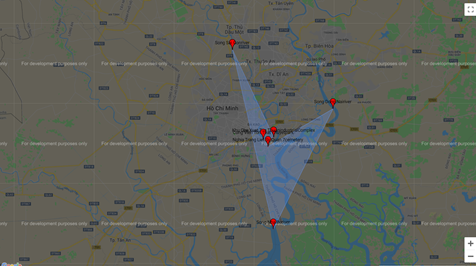

# [Kimmich](https://kimmich.tk/)
### Find tourist destination information from the image.

<p float="left">
  
   
   
</p>

* [Screenshot](#screenshot)
* [How to use this website](#how-to-use-this-website)
* [Requisites](#requisites)
* [Setup](#setup)
  * [Run code](#run-code)
* [Report](#report)
* [References](#references)

## Screenshot





## How to use this website

Login to website by your username and password.
Upload your landmark image, and you will see the recommendation about that place, including history, maps location, food recommendation, area culture.
  
## Requisites

* [Python 3.7.6](https://www.python.org/downloads/release/python-376/)

## Setup

First clone the repository:
```
git clone https://github.com/importkeras/hackcovy.git
```

Make sure that you have installed Python.
Clone this folder and install requirements library in <requirements.txt>

```
pip install requirements.txt
```

Running <setup.py> to starting the web server
```
python setup.py
```

### Run code

The main and GUI code is in main.py.
To test whether the setup was successful, run the following command to use program GUI.
```
python main.py
```
## Homepage

* kimmich.tk (https://kimmich.tk/)

## References

This project builds from the work listed below:

* Python
* Flask
* Google Maps API
* Landmarks detection API
